# Fake e-commerce

## Descripción

Un ejemplo de e-commerce orientado a demostrar habilidades como backend developer.

## Tecnologías

<div style="display: flex; width: 100%; justify-content: center;">
    <a href="https://www.typescriptlang.org/">
        
    </a>
    <a href="https://nestjs.com">
        
    </a>
    <a href="https://www.prisma.io/">
        
    </a>
    <a href="https://www.sqlite.org/index.html">
        
    </a>
</div>

## Instalación

npm:

```bash

$  npm  install

```

yarn:

```bash

$  yarn  install

```

## Para correr la app

npm:

```bash

# development

$  npm  run  start


# watch mode

$  npm  run  start:dev


# production mode

$  npm  run  start:prod

```

yarn:

```bash

# development

$  yarn  start


# watch mode

$  yarn  start:dev


# production mode

$  yarn  start:prod

```

## Pruebas

npm:

```bash

# unit tests

$  npm  run  test

```

yarn:

```bash

# unit tests

$  yarn  test

```

## Gestor de Base de Datos

npm:

```bash

# database manager

$  npm  run  prisma -- studio

```

yarn:

```bash

# database manager

$  yarn prisma studio

```

## Resolución de Problemas

##### 1 - Sistema de autorización:

Cada request debe contener un token que identifique al
usuario que está accediendo al endpoint. Este token debe ser único para ese
usuario y debe tener una vigencia máxima de 30 minutos.

##### Respuesta:

Para obtener el token de un usuario, primero se debe iniciar sesión en el sistema. Luego se obtiene el token de acceso de la
respuesta para utilizarlo en los demás endpoints, mediante la cabecera "Authorization". Se debe incluir la cadena "Bearer" seguido
del token en la cabecera de la siguiente manera:

`Authorization: Bearer <token>`

Si se está utilizando POSTMAN, se puede usar las herramientas disponibles para agregar esta cabecera a sus solicitudes.

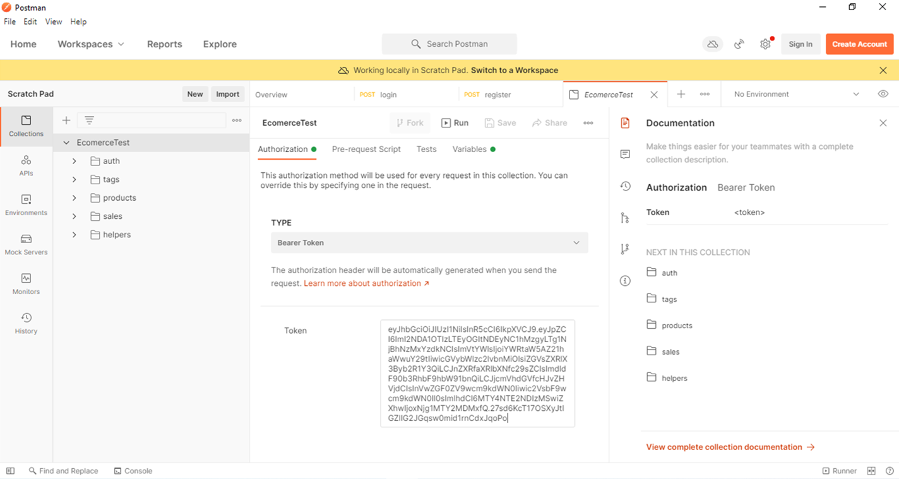</img>

Es importante tener en cuenta que el token de acceso tiene una duración limitada. En este caso, el token expira después de 30 minutos. Se puede encontrar esta información en el archivo ``src/modules/auth/auth.module.ts`` en la línea que contiene "expiresIn" (línea 19).

```typescript
import { forwardRef, Module } from '@nestjs/common';
import { AuthService } from './auth.service';
import { AuthController } from './auth.controller';
import { UsersModule } from '../users/users.module';
import { JwtModule } from '@nestjs/jwt';
import { JwtStrategy } from './strategies/jwt.strategy';
import { PassportModule } from '@nestjs/passport';
import { ConfigService } from '@nestjs/config';
import { RolesModule } from '../roles/roles.module';
import enviroment from '@/config/enviroment';

@Module({
  imports: [
    forwardRef(() => UsersModule),
    PassportModule,
    RolesModule,
    JwtModule.register({
      secret: enviroment().jwt.secret,
      signOptions: { expiresIn: '30m' }
    }),
  ],
  providers: [AuthService, JwtStrategy, ConfigService],
  controllers: [AuthController],
  exports: [AuthService, JwtStrategy],
})
export class AuthModule {}
```

###### Para iniciar sesión en el sistema, debe utilizar el siguiente endpoint:

``POST - http://localhost:3000/api/auth/login``

En el cuerpo de la solicitud, se debe incluir el correo electrónico y la contraseña del usuario. Si la solicitud es exitosa,  se recibirá una respuesta que contiene los datos generales del usuario (excepto la contraseña) y el token de acceso.

###### Para obtener todos los roles, se debe utilizar el siguiente endpoint:

``GET - http://localhost:3000/api/roles``

La respuesta contendrá un arreglo de roles, cada uno compuesto por su id y su nombre.

###### Para registrar un usuario en el sistema, se debe utilizar el siguiente endpoint:

``POST - http://localhost:3000/api/auth/register``

En el cuerpo de la solicitud, se debe incluir el correo electrónico, el nombre y la contraseña del usuario. También se puede incluir el id del rol del usuario si es necesario. Si la solicitud es exitosa, se recibirá un mensaje de confirmación. Tenga en cuenta que existen validaciones para los campos de correo electrónico, nombre y contraseña.

###### Para obtener los datos del usuario authenticado, se debe utilizar el siguiente endpoint:

``GET - http://localhost:3000/api/auth/me``

##### 2 - CRUD de productos

Todos los usuarios pueden ver productos por su sku
(identificador) pero solo los administradores y editores pueden crear, editar y
eliminar artículos, el resto de los usuarios solo pueden consultar. Cada producto
debe tener:
● Nombre o título
● Precio.
● Cantidad en stock.
● Categoría.
● Tags.
● Descripción.
● Información adicional.
● Valoración.
● Sku (identificador único).
● Imágenes asociadas (solo urls).

##### Respuesta:

En el sistema, cada usuario tiene asignado un rol que está compuesto por diversos permisos, tal como se puede observar en el siguiente ejemplo:

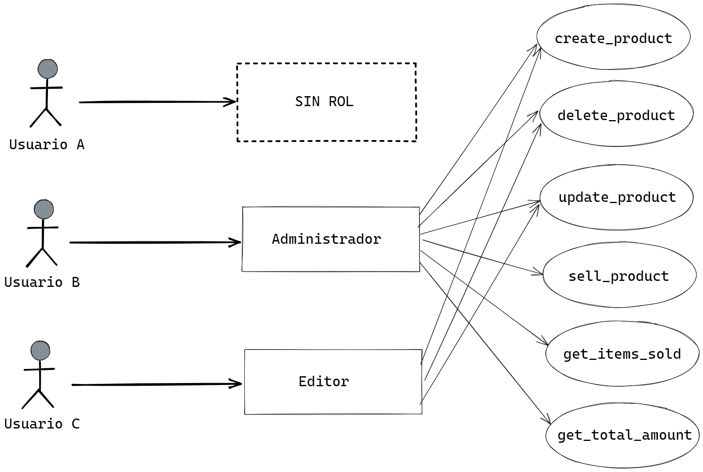</img>

> Los roles y permisos se agregan al sistema mediante el servicio "launcher" ``src/core/launcher/launcher.service.ts`` para facilitar la resolución de problemas.

Esto significa que cualquier usuario puede obtener un producto utilizando su "sku", pero para crear, actualizar o eliminar un producto, el usuario debe tener el permiso correspondiente en su rol, como se muestra en los siguientes ejemplos.

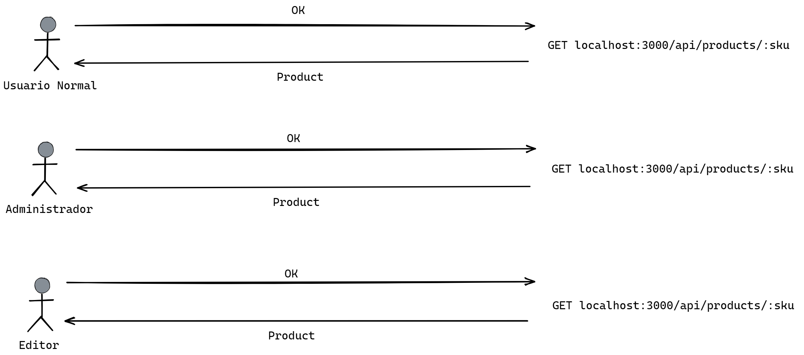</img>

> Para obtener un producto por su sku, se debe consultar el siguiente endpoint ``GET - localhost:3000/api/products/:sku``.

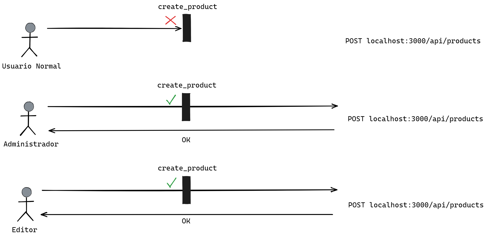</img>

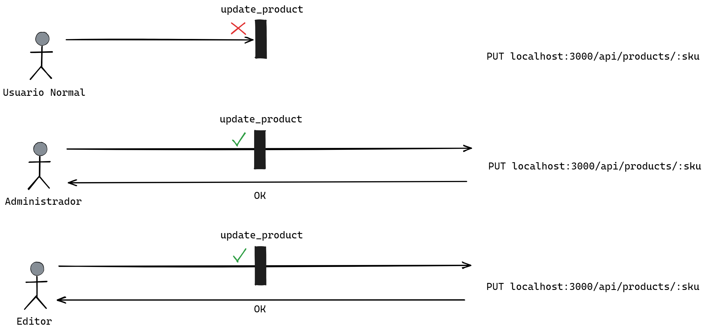</img>

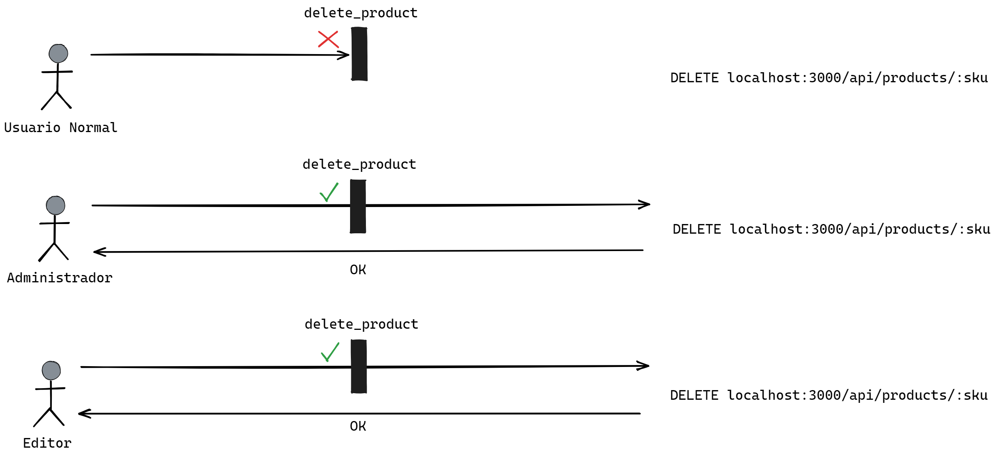</img>

###### Crear un Producto

Para crear un producto, es necesario enviar una solicitud POST al endpoint ``http://localhost:3000/api/products`` con las siguientes propiedades en el cuerpo de la solicitud:

- name: el nombre del producto.
- price: el precio del producto.
- stockQuantity: la cantidad de stock disponible del producto.
- category: la categoría a la que pertenece el producto.
- tagIds: un arreglo de ids de los tags asociados al producto.
- additionalInformation: información adicional sobre el producto.
- assessment: la valoración del producto.
- description: una descripción detallada del producto.
- urlAssociatedImages: un arreglo de URLs de imágenes asociadas al productos

si los ids de los tags no existen, se producirá un error. Para poder obtener los tags existentes, se puede auxiliar del siguiente enpoint: ``GET - http://localhost:3000/api/tags``

###### Actualizar un Producto

Para actualizar un producto, es necesario enviar una solicitud PUT al endpoint http://localhost:3000/api/products con las siguientes propiedades en el cuerpo de la solicitud:

- name: el nombre del producto.
- price: el precio del producto.
- stockQuantity: la cantidad de stock disponible del producto.
- category: la categoría a la que pertenece el producto.
- tagIds: un arreglo de ids de los tags asociados al producto.
- additionalInformation: información adicional sobre el producto.
- assessment: la valoración del producto.
- description: una descripción detallada del producto.
- urlAssociatedImages: un arreglo de URLs de imágenes asociadas al producto.

Es importante tener en cuenta que, al actualizar un producto mediante las url de imágenes, se eliminarán todas las url asociadas y se asignarán las nuevas url proporcionadas.

Si los ids de los tags proporcionados no existen en la base de datos, se generará un error.

###### Eliminar un Producto

Si se desea eliminar un producto específico, se debe enviar una solicitud DELETE al endpoint ``http://localhost:3000/api/products/:sku``, donde :sku es el sku del producto que desea eliminar. Si el sku proporcionado no se encuentra en la base de datos, se generará un error.

##### 3 - Endpoint sobre resultados de busqueda

Endpoint que entregue resultados de una búsqueda enviando cualquiera de las
características del producto, una o varias (permitir paginación en base de 10
resultados). Si no se envía ninguna característica el resultado debe ser la lista de
artículos paginada.

##### Respuesta:

```text
POST      -http://localhost:3000/api/products/fecth

QUERY     -page: pagina actual

BODY      -name: busca productos por su nombre.
          -price: busca por el precio del producto.   
          -stockQuantity: busca por la cantidad de stock disponible.
          -category: busca por la categoría del producto.   
          -tagIds: busca por las ids de sus tags.
          -additionalInformation: busca por la información adicional del producto.
          -assessment: busca por la valoración del producto. 
          -description: busca por la descripción del producto.
          -associatedImage: busca por la url guardada de la imagen asociada al producto.

RESPONSE  -products: total de productos filtrados
          -page: página actual,
          -totalElement: total de productos,
          -totalPage: total de páginas,
          -perPage: total de productos por página
```

##### 4 - Endpoint sobre cantidad de resultados de busqueda

Endpoint que entregue sólo la cantidad de resultados de una búsqueda enviando
cualquiera de las características del producto.

##### Respuesta:

```text
POST      -http://localhost:3000/api/products/total-element

BODY      -name: busca productos por su nombre.
          -price: busca por el precio del producto.   
          -stockQuantity: busca por la cantidad de stock disponible.
          -category: busca por la categoría del producto.   
          -tagIds: busca por las ids de sus tags.
          -additionalInformation: busca por la información adicional del producto.
          -assessment: busca por la valoración del producto. 
          -description: busca por la descripción del producto.
          -associatedImage: busca por la url guardada de la imagen asociada al producto.

RESPONSE  totalElement: total de productos
```

##### 5 - Endpoint que permita “vender” un artículo.

Esta funcionalidad debe eliminar un (1)
artículo del stock. No se puede vender más de un (1) tipo de artículo a la vez y no se
puede vender más de un (1) artículo del mismo tipo a la vez.

##### Respuesta:

Para poder vender un producto, el usuario necesita tener el permiso "sell_product" incluido en su rol correspondiente.

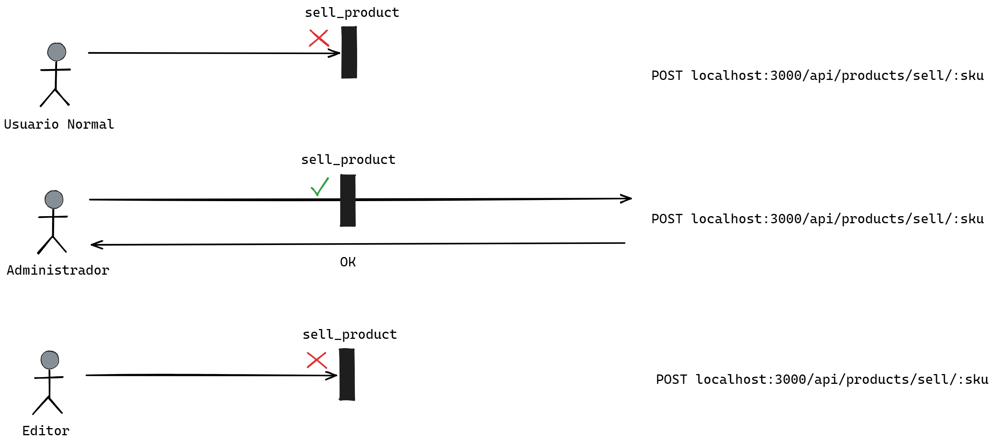</img>

```text
POST      -http://localhost:3000/api/products/sell/:sku

RESPONSE  -message: mensaje de confirmación

ERRORS    -si el campo stockQuantity es 0, no permite vender
	  -el producto debe existir en la base de datos
```

##### 6 - Endpoint que permita mostrar la lista de artículos vendidos.

##### Respuesta:

Para mostrar la lista de articulos vendidos, el usuario necesita tener el permiso "get_items_sold" incluido en su rol correspondiente.

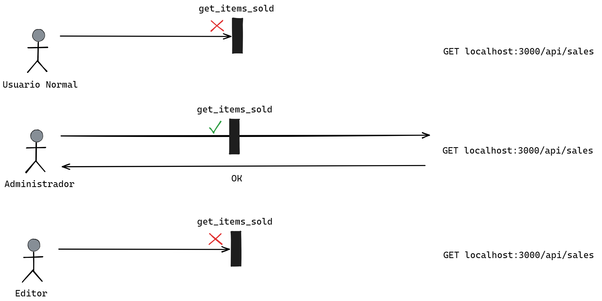</img>

```text
GET       -http://localhost:3000/api/sales

QUERY     -page: pagina actual

RESPONSE  -sales: total de ventas filtradas
          -page: página actual,
          -totalElement: total de ventas,
          -totalPage: total de páginas,
          -perPage: total de ventas por página
```

##### 7 - Endpoint que permita mostrar la ganancia total.

##### Respuesta:

Para poder ver la ganancia total de ventas, el usuario necesita tener el permiso "get_total_amount" incluido en su rol correspondiente.

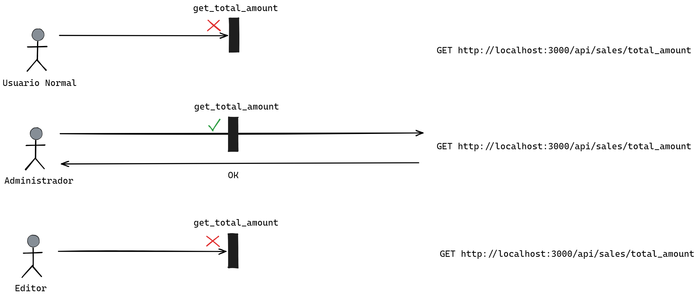</img>

```text
GET       -http://localhost:3000/api/sales/total_amount

RESPONSE  -totalAmount: monto total de ventas
```

##### 8 - Endpoint que permita mostrar los artículos que no tienen stock en el almacén.

##### Respuesta:

```text
GET       -http://localhost:3000/api/products/without-stock-quantity

QUERY     -page: pagina actual

RESPONSE  -products: total de productos filtrados con 0 stock
          -page: página actual,
          -totalElement: total de productos,
          -totalPage: total de páginas,
          -perPage: total de productos por página
```

## Datos Extras

### Arquitectura de Carpetas

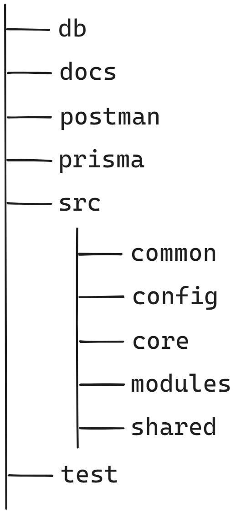</img>

- db: esta carpeta almacena la base de datos del proyecto, que en este caso es SQLite.
- docs: se utiliza para almacenar recursos que se emplean en el archivo "readme.md"
- postman: en esta carpeta, se encuentra el archivo ``doc.postman.json`` que se utiliza para ayudar en la consulta de endpoints.
- prisma: esta carpeta contiene el archivo de configuración y el esquema de Prisma.
- src: esta carpeta contiene la lógica de negocio de la aplicación.
  - common: en esta carpeta, se encuentran los servicios comunes del proyecto, como guards, mocks, utils, interfaces, libs, entre otros.
  - shared: aquí se encuentran los módulos auxiliares reutilizables.
  - config: esta carpeta contiene el módulo de configuración.
  - modules: aquí se encuentran los módulos que manejan la lógica de negocio.
  - core: esta carpeta contiene los módulos principales del sistema.
- test: contiene las pruebas end-to-end (e2e) de la aplicación.

### Modelación de la Base de Datos

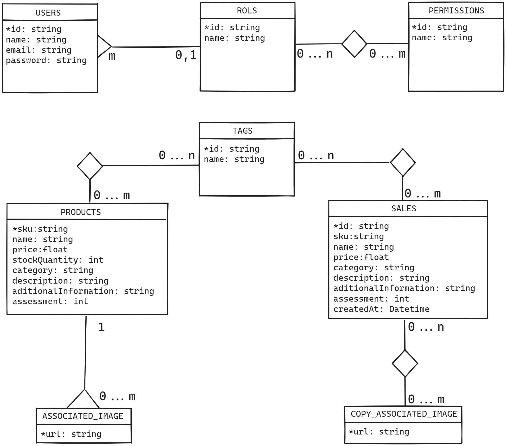</img>

### Launcher.service.ts

El archivo launcher.service.ts, que se encuentra en la ruta ``src/core/launcher/launcher.service.ts``, es responsable de inicializar la base de datos si se detecta que está vacía. Este servicio se activa automáticamente cuando se inicia el servidor y se encarga de guardar los datos necesarios para el funcionamiento de la aplicación, incluso aquellos que no tienen endpoints asociados.

### Postman

Para utilizar Postman, se puede importar el archivo ``doc.postman.json`` que se encuentra en la ruta ``postman/doc.postman.json``. Se debe asegurar seguir las instrucciones adecuadas al importar el archivo para que se pueda aprovechar todas las funcionalidades de manera efectiva en su proyecto. A continuación, algunas características sobre su uso:

- Se puede utilizar el conjunto de ``helpers`` de Postman y agilizar las consultas a los endpoints ya creados.
- En el endpoint ``http://localhost:3000/api/auth/login``, existe un script que se encarga de establecer automáticamente el accessToken, lo cual evita la necesidad de manejarlo manualmente.

## Autor

[David Alfonso Pereira](https://david200197.github.io/david-portafolio)
